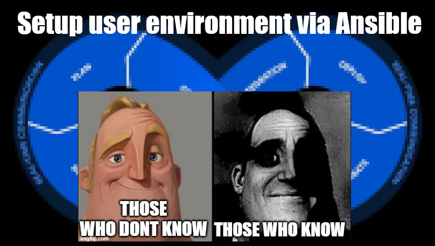

# Gerundium user shell setup

🏠 This repository contains shell scripts that will configure the basic user shell.



## TL;DR;

### Docker examples
```bash

# Start a docker container with ubuntu linux
docker run --name ubuntu -it \           
        --volume="$PWD:/transfer" \
        ubuntu:jammy

# or
# Start a docker container with rocky linux
docker run --name rocky -it \
        --volume="$PWD:/transfer" \
        rockylinux:9

# Execute installation script inside the container
bash /transfer/00_install.sh
```
